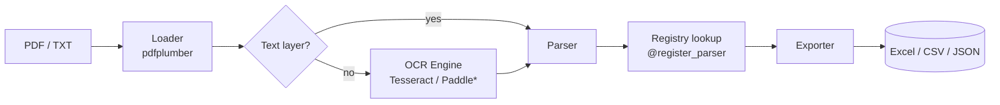

# pdf-ocr-toolkit

> 🇨🇳 **中文简介**：一个可插拔的 PDF OCR 工具包，把扫描件业务单据（发票、送货单等）转换成结构化的 Excel/CSV/JSON 数据。核心亮点是**解析器注册表机制**——继承基类并加一个 `@register_parser("your_doc_type")` 装饰器即可支持新单据类型；OCR 引擎与异步队列（Celery/Redis）全部为可选依赖，没装也能跑。代码采用清晰的四层流水线架构（loader → ocr → parser → exporter），适合作为工程能力展示项目。

**A pluggable PDF OCR toolkit that turns scanned business documents (invoices, delivery notes, etc.) into structured Excel/CSV data.**

<!-- screenshot: web ui -->
<!-- screenshot: cli output -->
<!-- screenshot: excel output -->

---

## ✨ Features

- **🔌 Pluggable parser architecture** — support a new document type by subclassing `BaseParser` and adding one `@register_parser("name")` decorator. No framework code changes needed.
- **🧱 Layered pipeline** — `loader → ocr → parser → exporter`, each stage with a narrow, testable contract.
- **🅾️ OCR is optional, never a hard dependency** — embedded PDF text layers are extracted via `pdfplumber`; Tesseract / PaddleOCR are *extras* that degrade gracefully with clear install hints when missing. The package always imports.
- **📊 Multiple export targets** — styled Excel workbooks (`openpyxl`), flat CSV (line items) and full JSON payloads.
- **⚡ Sync by default, async when you need it** — the CLI and API run in-process out of the box; point `PDF_OCR_CELERY_BROKER_URL` at Redis and the same work runs on Celery workers.
- **🌐 FastAPI service included** — upload / job-status / download REST endpoints plus a minimal browser upload page.
- **🛠️ Rich base-parser toolbox** — regex anchors, label/keyword scanning, money & date normalisation, line-item table extraction helpers.
- **📦 Two built-in demo parsers** — generic invoice and delivery note, shipped with fictional sample documents and a reportlab PDF generator.

## 🏗️ Architecture

```
                         ┌──────────────────────────────────────────┐
                         │            CLI  /  FastAPI               │
                         │     (python -m pdf_ocr_toolkit)          │
                         └───────────────────┬──────────────────────┘
                                             │
                         ┌───────────────────▼──────────────────────┐
                         │              tasks / runner              │
                         │  (sync process_document | Celery task)   │
                         └───────────────────┬──────────────────────┘
                                             │
   ┌──────────┐   ┌────────────┐   ┌─────────▼────────┐   ┌────────────────┐
   │  loader  │──▶│ ocr_engine │──▶│  parser (pluggable) │──▶│   exporter     │
   │ pdfplumber│   │ text-layer │   │  BaseParser +      │   │ xlsx / csv /   │
   │  / .txt   │   │ tesseract* │   │  @register_parser  │   │ json           │
   │           │   │ paddle*    │   │  ├ invoice         │   │ openpyxl       │
   └──────────┘   └────────────┘   │  └ delivery_note   │   └────────────────┘
                                   └───────────────────┘
        * optional extras — graceful degradation when not installed
```



## 🚀 Quick Start

### 1. Install

```bash
git clone https://github.com/<your-username>/pdf-ocr-toolkit.git
cd pdf-ocr-toolkit

python -m venv .venv && source .venv/bin/activate   # Windows: .venv\Scripts\activate
pip install -e .
```

Only need OCR for image-only/scanned PDFs? Install the extra dependencies
(also requires the Tesseract system binary):

```bash
pip install -r requirements-ocr.txt     # pytesseract + pdf2image
# or, for PaddleOCR:
pip install -e ".[paddle]"
```

### 2. Generate the fictional sample documents

```bash
pip install -r requirements-dev.txt     # provides reportlab for the generator
pdf-ocr generate-samples
# → samples/generated/invoice_sample.pdf
# → samples/generated/delivery_note_sample.pdf
```

### 3. Run extraction from the CLI

```bash
# Excel output (default)
pdf-ocr run samples/generated/invoice_sample.pdf --type invoice --out result_invoice.xlsx

# JSON output
pdf-ocr run samples/generated/delivery_note_sample.pdf --type delivery_note --out result_dn.json

# List available parsers
pdf-ocr list
```

Equivalent module invocation: `python -m pdf_ocr_toolkit run ...`

### 4. Start the API service

```bash
uvicorn pdf_ocr_toolkit.api.main:app --reload
# open http://127.0.0.1:8000/ for the upload page
```

### 5. Call the API with curl

```bash
# Upload a document (synchronous mode: job is done when the response returns)
curl -X POST http://127.0.0.1:8000/api/jobs \
  -F "file=@samples/generated/invoice_sample.pdf" \
  -F "doc_type=invoice" \
  -F "fmt=xlsx"
# → {"job_id":"a1b2c3d4e5f6","status":"done","async":false}

# Inspect the parsed preview
curl http://127.0.0.1:8000/api/jobs/a1b2c3d4e5f6

# Download the result file
curl -OJ http://127.0.0.1:8000/api/jobs/a1b2c3d4e5f6/download
```

### Async mode (optional)

Set a broker URL and run a Celery worker — API jobs then return immediately
as `pending` and the web UI polls until completion:

```bash
export PDF_OCR_CELERY_BROKER_URL=redis://localhost:6379/0
celery -A pdf_ocr_toolkit.tasks:app worker --loglevel=info
uvicorn pdf_ocr_toolkit.api.main:app
```

## 📁 Project Structure

```
pdf-ocr-toolkit/
├── src/pdf_ocr_toolkit/
│   ├── __init__.py
│   ├── __main__.py              # python -m pdf_ocr_toolkit
│   ├── cli.py                   # argparse CLI: generate-samples / run / list
│   ├── tasks.py                 # process_document + optional Celery app
│   ├── core/
│   │   ├── config.py            # pydantic-settings (env prefix PDF_OCR_)
│   │   ├── logging.py           # central logger setup
│   │   └── registry.py          # ParserRegistry + @register_parser
│   ├── pipeline/
│   │   ├── loader.py            # PDF (.pdf via pdfplumber) / TXT loading
│   │   ├── ocr_engine.py        # text-layer | tesseract* | paddle* engines
│   │   ├── base_parser.py       # BaseParser + extraction toolbox
│   │   ├── exporter.py          # xlsx / csv / json writers
│   │   └── runner.py            # pipeline orchestration
│   ├── parsers/
│   │   ├── invoice.py           # @register_parser("invoice")
│   │   └── delivery_note.py     # @register_parser("delivery_note")
│   └── api/
│       ├── main.py              # FastAPI app factory + endpoints
│       └── templates/
│           └── upload.html      # minimal browser upload page
├── samples/
│   ├── fixtures/                # canonical fictional document text
│   ├── expected_output/         # expected JSON for regression checks
│   └── generate_samples.py      # reportlab PDF generator
├── tests/                       # pytest suite (no external OCR needed)
├── requirements.txt             # lean core dependencies
├── requirements-ocr.txt         # optional OCR extras
├── requirements-dev.txt         # pytest / reportlab / httpx
├── pyproject.toml               # package + console_scripts entry point
└── LICENSE                      # MIT
```

## 🧩 Writing Your Own Parser

A new document type is a single class. The base class provides regex/keyword
anchors, money/date normalisation and line-table helpers:

```python
# my_parsers/receipt.py
from pdf_ocr_toolkit.core.registry import register_parser
from pdf_ocr_toolkit.pipeline.base_parser import BaseParser, LineItem, ParseResult
from pdf_ocr_toolkit.pipeline.loader import Document
import re

@register_parser("receipt")
class ReceiptParser(BaseParser):
    label = "Expense Receipt"
    description = "Simple expense receipt: merchant, date, total, tax."

    _ROW = re.compile(r"^(?P<desc>.+?)\s{2,}(?P<amount>\d+\.\d{2})$")

    def parse(self, document: Document) -> ParseResult:
        result = ParseResult(document_type="receipt")
        lines = self.lines_of(document.full_text)

        self.require(result, "merchant", lines[0] if lines else None)
        self.require(result, "date",
                     self.normalise_date(self.value_after_label(lines, "date")))
        self.require(result, "total",
                     self.money_after_label(lines, "total"))

        for line in lines:
            m = self._ROW.match(line)
            if m and "total" not in m.group("desc").lower():
                result.line_items.append(
                    LineItem(description=m.group("desc").strip(),
                             amount=self.to_money(m.group("amount")))
                )
        return result
```

Then just import the module before running (registration happens on import):

```python
import my_parsers.receipt           # registers "receipt"
from pdf_ocr_toolkit.pipeline.runner import run_pipeline

result = run_pipeline("my_receipt.pdf", "receipt")
```

### BaseParser helper cheat-sheet

| Helper | Purpose |
| --- | --- |
| `lines_of(text)` | Split OCR/text output into clean lines |
| `find_line(lines, *keywords)` | Index of the first line containing all keywords (word-boundary aware) |
| `value_after_label(lines, *keywords)` | Value after `Label: value` (or on the following line) |
| `block_after_label(lines, *keywords)` | Multi-line block following a label (addresses, parties) |
| `money_after_label(lines, *keywords)` | Same, normalised to `float` |
| `to_money(s)` / `to_number(s)` | `"$1,234.50"` → `1234.5` |
| `normalise_date(s)` | `Mar 15, 2025` → `2025-03-15` |
| `search(pattern, text, group)` | Thin regex wrapper returning `None` on no match |

## 📡 API Reference

| Method | Path | Description |
| --- | --- | --- |
| `GET` | `/` | Minimal browser upload page |
| `GET` | `/health` | Liveness probe, engine mode, registered parsers |
| `GET` | `/api/parsers` | Parser metadata (key, label, description) |
| `POST` | `/api/jobs` | Multipart upload: `file`, `doc_type`, `fmt` (`xlsx`/`csv`/`json`) → `job_id` |
| `GET` | `/api/jobs/{id}` | Job status + parsed field preview |
| `GET` | `/api/jobs/{id}/download` | Download the exported result file |

Interactive docs are available at `/docs` (Swagger UI) once the service is running.

## ⚙️ Configuration

All settings are environment variables prefixed with `PDF_OCR_` (or a `.env` file):

| Variable | Default | Purpose |
| --- | --- | --- |
| `PDF_OCR_LOG_LEVEL` | `INFO` | Logging level |
| `PDF_OCR_OCR_ENGINE` | `auto` | `auto` / `text` / `tesseract` / `paddle` |
| `PDF_OCR_OCR_LANGUAGE` | `eng` | OCR language code |
| `PDF_OCR_OCR_DPI` | `300` | Render DPI for OCR rasterisation |
| `PDF_OCR_OUTPUT_DIR` | `./output` | Working/output directory |
| `PDF_OCR_CELERY_BROKER_URL` | *(empty)* | Celery broker; empty = synchronous mode |
| `PDF_OCR_REDIS_URL` | *(empty)* | Alternative broker shorthand |
| `PDF_OCR_API_UPLOAD_LIMIT_MB` | `20` | Max upload size |

## 🧪 Testing

```bash
pip install -r requirements-dev.txt
pytest
```

The suite covers the registry/decorator mechanism, both built-in parsers
(asserted against committed expected-output JSON), all three exporters, the
synchronous pipeline and the no-OCR graceful-degradation path. **No external
OCR binaries or Redis are required.**

## 🗺️ Roadmap

- [ ] PDF table ruling-line extraction for denser, bordered layouts
- [ ] PDFium/PyMuPDF loader backend as a faster alternative to pdfplumber
- [ ] Confidence scores propagated from OCR engines into `ParseResult`
- [ ] Persistent job store (SQLite) for the API layer
- [ ] More built-in parsers (purchase orders, receipts, customs declarations)
- [ ] Webhook callbacks for completed async jobs
- [ ] i18n label packs (Chinese VAT invoice keywords, etc.)

## 📄 License

[MIT](LICENSE) © Yin Jing

All sample data shipped with this project (companies, people, document
numbers, addresses) is **entirely fictional** and generated for demonstration
purposes only.
